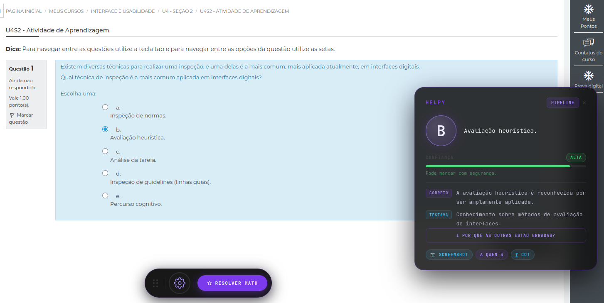
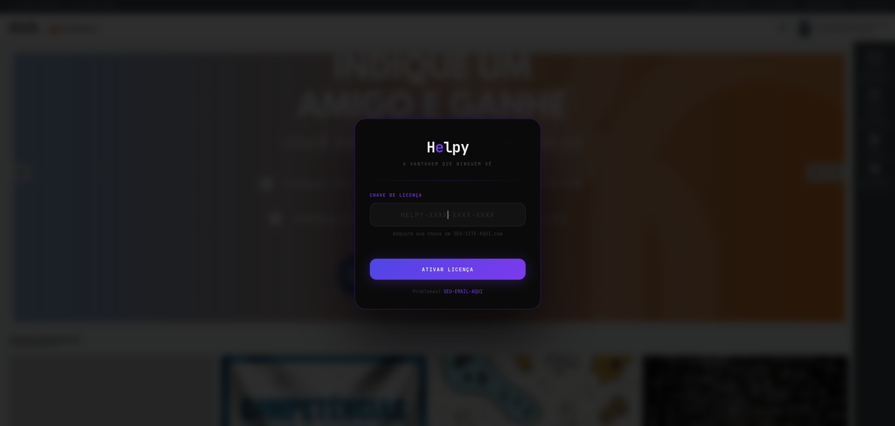
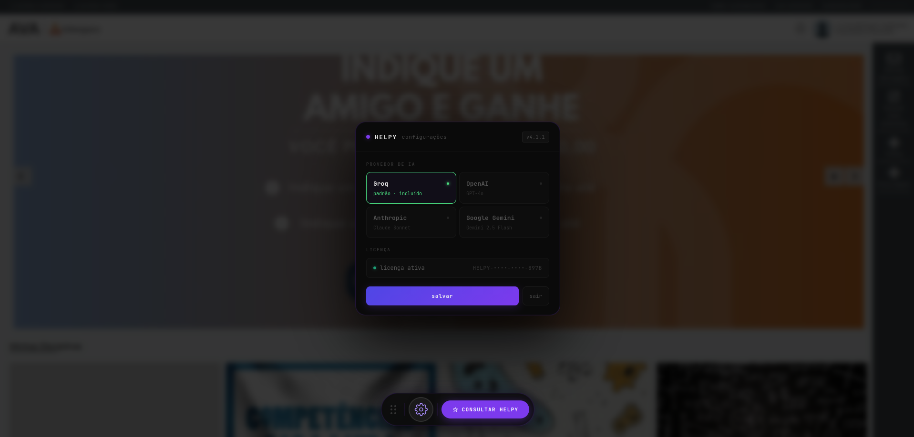

# Helpy — Assistente Acadêmico com IA

Extensão para navegador que analisa questões de múltipla escolha em plataformas EAD utilizando inteligência artificial, sugerindo a alternativa mais provável com explicação, nível de confiança e análise de cada alternativa.

> ⚠️ Repositório privado. O código-fonte está disponível mediante solicitação para fins de avaliação técnica.

---

## Visão Geral

O Helpy é composto por três partes:

- **Script (client):** userscript Tampermonkey que roda no navegador, detecta questões no DOM do AVA, extrai conteúdo (texto, imagens, fórmulas) e exibe a análise na interface.
- **Backend (API):** servidor Node.js hospedado na Vercel que autentica usuários, roteia requisições para provedores de IA e gerencia licenças.
- **Infraestrutura:** Supabase (banco de dados + RLS), Stripe (pagamentos), Resend (e-mails transacionais).

---

## Arquitetura

```
┌─────────────────────────────────────────────────────────────────┐
│                         NAVEGADOR                               │
│                                                                 │
│  ┌──────────────┐    ┌──────────────┐    ┌──────────────────┐  │
│  │  Detecção de │───▶│  Extração de │───▶│  Exibição da     │  │
│  │  questão DOM │    │  conteúdo    │    │  análise (bubble) │  │
│  └──────────────┘    └──────┬───────┘    └──────────────────┘  │
│                             │                                   │
│         Tampermonkey        │  GM_xmlhttpRequest                │
└─────────────────────────────┼───────────────────────────────────┘
                              │
                              ▼
┌─────────────────────────────────────────────────────────────────┐
│                     BACKEND (Vercel)                             │
│                                                                 │
│  ┌────────────┐  ┌────────────┐  ┌────────────┐               │
│  │ /validate  │  │   /ai      │  │  /webhook  │               │
│  │ JWT auth   │  │  proxy IA  │  │  Stripe    │               │
│  └─────┬──────┘  └─────┬──────┘  └─────┬──────┘               │
│        │               │               │                       │
│        │    ┌───────────┴────────┐      │                      │
│        │    │   Load Balancer    │      │                      │
│        │    │  (pool de chaves)  │      │                      │
│        │    └─┬──────┬─────┬────┘      │                      │
│        │      │      │     │           │                       │
│        │      ▼      ▼     ▼           │                      │
│        │    Groq  OpenAI  Gemini       │                      │
│        │           Anthropic           │                      │
│        │                               │                      │
└────────┼───────────────────────────────┼──────────────────────┘
         │                               │
         ▼                               ▼
┌─────────────────┐           ┌─────────────────┐
│    Supabase     │           │     Stripe      │
│                 │           │                 │
│  • licenses    │           │  • checkout     │
│  • user_keys   │           │  • webhooks     │
│  • usage_logs  │           │                 │
└─────────────────┘           └─────────────────┘
```

---

## Stack

| Camada | Tecnologia | Justificativa |
|--------|-----------|---------------|
| Client | JavaScript (Tampermonkey) | Acesso direto ao DOM do AVA sem dependências externas |
| Backend | Node.js (Vercel Functions) | Serverless, cold start rápido, integração nativa com GitHub |
| Banco de dados | Supabase (PostgreSQL) | RLS nativo, API REST automática, auth integrado |
| Provedores de IA | Groq, OpenAI, Anthropic, Gemini | Redundância entre provedores, fallback automático |
| Pagamento | Stripe | Webhooks confiáveis, checkout pronto, sem gerenciar cartões |
| E-mail | Resend | API simples, templates em HTML, boa entregabilidade |
| Hosting | Vercel | Deploy automático via Git, edge functions, domínio customizado |
| Landing page | Framer | Prototipação rápida, sem código, deploy instantâneo |

---

## Decisões Técnicas

### Autenticação: JWT com refresh automático

O fluxo de autenticação funciona em duas etapas. O usuário insere a chave de licença, o endpoint `/validate` verifica no banco e retorna um token JWT com validade de 2 horas. Todas as requisições subsequentes usam esse token via Bearer auth. Quando o token expira, o script renova automaticamente chamando `/validate` novamente sem interação do usuário.

**Por que JWT e não session?** O backend é serverless (Vercel Functions) — não há servidor persistente para manter sessões em memória. JWT é stateless e se encaixa perfeitamente nesse modelo.

### Load Balancer: usage-based com cooldown

O sistema mantém um pool de até 20 chaves Groq. Cada chave rastreia o número de requests na janela atual, o timestamp do último uso e o status de cooldown. A seleção prioriza a chave com menor uso na janela. Em caso de empate, escolhe a que foi usada há mais tempo.

Quando uma chave recebe 429 (rate limit), entra em cooldown de 2 minutos. Após 10 erros consecutivos, o cooldown sobe para 10 minutos. O sistema tenta até 3 chaves diferentes antes de retornar erro ao cliente.

**Por que não round-robin simples?** Round-robin distribui igualmente, mas não considera que algumas chaves podem ter sido usadas por outros processos. O modelo usage-based adapta em tempo real ao uso efetivo de cada chave.

### Criptografia: AES-256-GCM para chaves de API dos usuários

Usuários podem conectar suas próprias chaves de OpenAI, Anthropic ou Gemini. Essas chaves são criptografadas com AES-256-GCM no servidor antes de serem armazenadas no banco. Cada chave tem seu próprio IV e auth tag. A chave mestra de criptografia fica exclusivamente em variável de ambiente no Vercel — nunca no código ou no banco.

**Por que GCM e não CBC?** GCM oferece autenticação integrada (AEAD), o que garante que os dados não foram alterados. CBC requer HMAC separado para garantir integridade, adicionando complexidade sem benefício.

### Roteamento de IA: detecção automática por disciplina

O script lê o breadcrumb da página do AVA para identificar a disciplina. Se detecta termos relacionados a matemática (cálculo, álgebra, estatística), roteia para o Qwen 3 32B com Chain of Thought. Se a questão contém imagens, usa Llama 4 Scout com visão computacional. Demais questões vão para o Llama 3.3 70B.

O backend normaliza as mensagens para o formato nativo de cada provedor (OpenAI-style para Groq/OpenAI, blocos image/source para Anthropic, inlineData para Gemini) e injeta o system prompt adequado (genérico ou matemático).

### Rate Limiting: dupla camada

- **Por IP no `/validate`:** máximo 10 tentativas em 2 minutos, bloqueio de 15 minutos após exceder (proteção contra brute force na chave de licença).
- **Por licença no `/ai`:** máximo 120 requisições a cada 24 horas, com janela deslizante e bloqueio temporário de 4 horas ao atingir o limite.

### Banco de dados: Row Level Security

Todas as tabelas (licenses, user_keys, usage_logs) têm RLS ativado com política de negação total para o role `anon`. Apenas o `service_role` (usado pelo backend) consegue acessar os dados. Isso garante que mesmo que as credenciais do Supabase vazem, não há acesso direto aos dados via API pública.

---

## Modelos de IA

| Modelo | Provedor | Uso | Contexto |
|--------|----------|-----|----------|
| Llama 3.3 70B | Groq | Questões de texto (humanas, biológicas, etc.) | Modelo padrão — rápido e preciso para múltipla escolha |
| Qwen 3 32B | Groq | Questões de matemática e exatas | Reasoning model com Chain of Thought para resolução passo a passo |
| Llama 4 Scout 17B | Groq | Questões com imagens | Modelo multimodal com suporte a visão computacional |
| GPT-4o | OpenAI | Alternativo (BYO key) | Usuário conecta sua própria chave |
| Claude Sonnet 4 | Anthropic | Alternativo (BYO key) | Usuário conecta sua própria chave |
| Gemini 2.5 Flash | Google | Alternativo (BYO key) | Usuário conecta sua própria chave |

---

## Pipeline de Processamento

```
Questão detectada no DOM
        │
        ├─ Extrai enunciado (texto + MathJax/LaTeX)
        ├─ Extrai alternativas (radio buttons + labels)
        └─ Extrai imagens (> 80px, bypass CORS via GM_xmlhttpRequest)
                │
                ▼
        Classifica disciplina (breadcrumb do AVA)
                │
        ┌───────┼───────┐
        │       │       │
        ▼       ▼       ▼
     Exatas   Imagem   Texto
        │       │       │
   Qwen 3    Llama 4  Llama 3.3
   + CoT     Vision   
        │       │       │
        └───────┼───────┘
                │
                ▼
        Backend normaliza mensagens
        por provedor e injeta system prompt
                │
                ▼
        Resposta parseada (JSON ou regex fallback)
                │
                ▼
        Exibição: conceito, dica, resposta,
        confiança, explicação, análise dos erros
```

---

## Segurança

| Camada | Medida |
|--------|--------|
| Autenticação | JWT com expiração de 2h + refresh automático |
| Chaves de API | AES-256-GCM, IV e auth tag por chave, chave mestra em env var |
| Rate limiting | Dupla camada: por IP (brute force) + por licença (uso diário) |
| Banco de dados | RLS com deny-all para anon, apenas service_role acessa |
| Comunicação | HTTPS em todas as chamadas, Bearer token em requests autenticados |
| Anti-replay | Webhooks Stripe verificados com HMAC-SHA256 + tolerância de 5 min |
| Sanitização | XSS prevention no client (escape de HTML em conteúdo da IA) |
| Payload | Limite de 5MB por request, máximo 5 imagens por questão |
| Erros | Sanitização de erros dos provedores — mensagens internas nunca vazam para o cliente |
| IP | Armazenado como hash SHA-256 truncado (16 chars) — nunca em texto puro |

---

## Fluxo de Pagamento

```
Cliente paga via Stripe Checkout
        │
        ▼
Stripe envia webhook (checkout.session.completed)
        │
        ▼
Backend verifica assinatura HMAC-SHA256
        │
        ▼
Gera chave HELPY-XXXX-XXXX-XXXX (única)
        │
        ▼
Insere licença no Supabase (status: active, 182 dias)
        │
        ▼
Envia e-mail via Resend com chave + link de instalação
        │
        ▼
Cliente clica no link → Tampermonkey intercepta → script instalado
```

---

## Screenshots

> As imagens abaixo são mockups representativos da interface do produto.

### Questão com resposta sugerida


### Modal de licença


### Configurações de provedor


---

## Status

🟡 Em desenvolvimento — MVP funcional, landing page em construção, ainda não distribuído publicamente.

---

## Contato

**Lucas Bertani Carneiro**
lucasbertanicarneiro@gmail.com

> Código-fonte disponível mediante solicitação para recrutadores e avaliação técnica.
